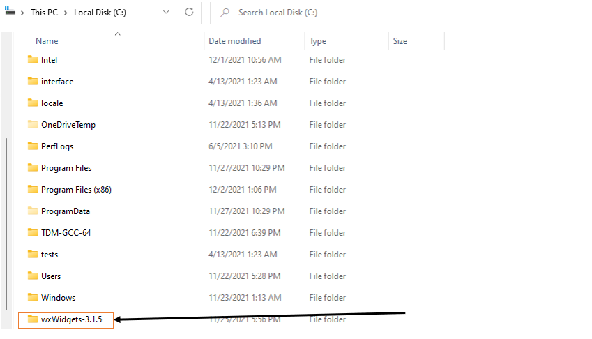
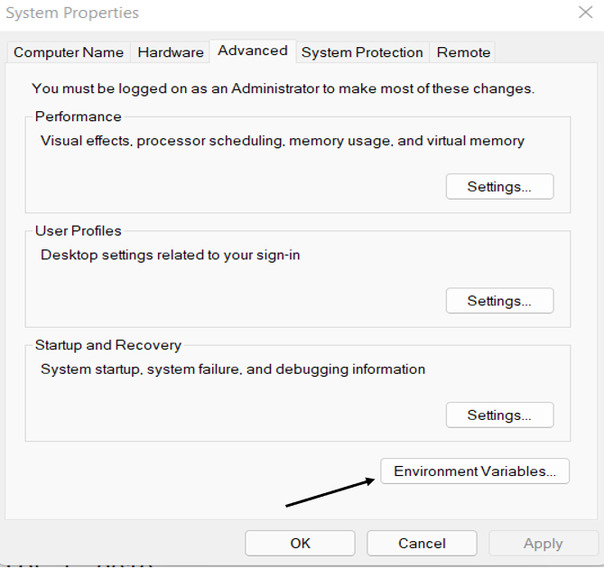
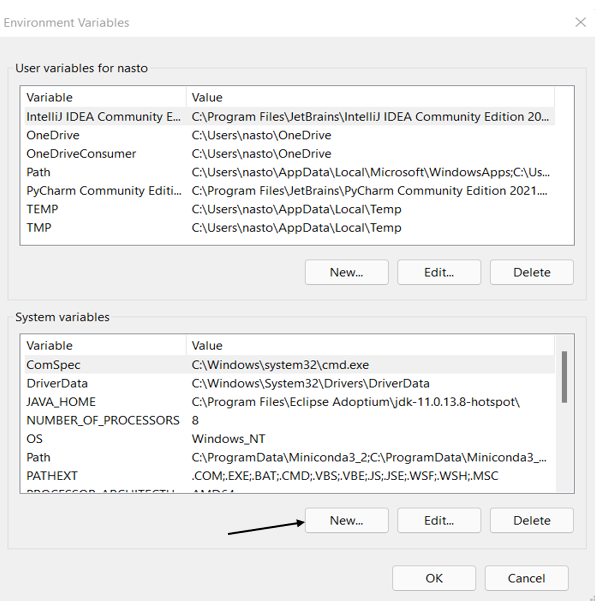
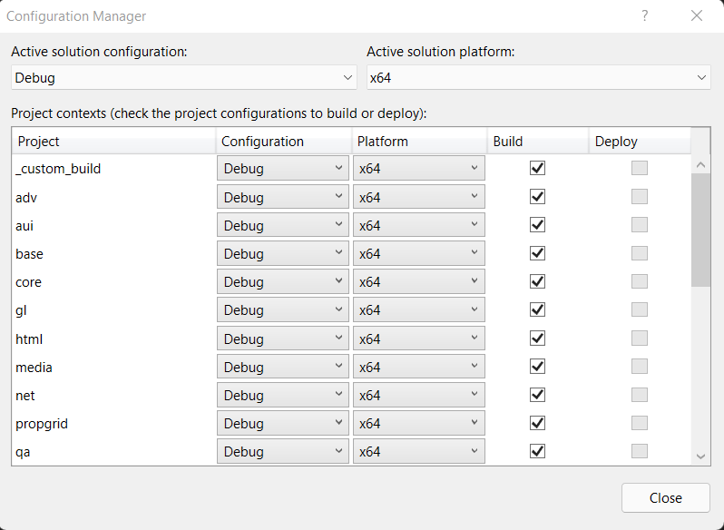
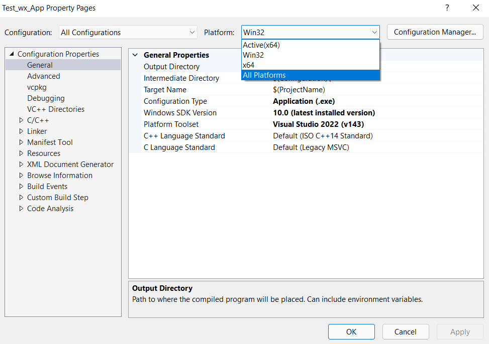
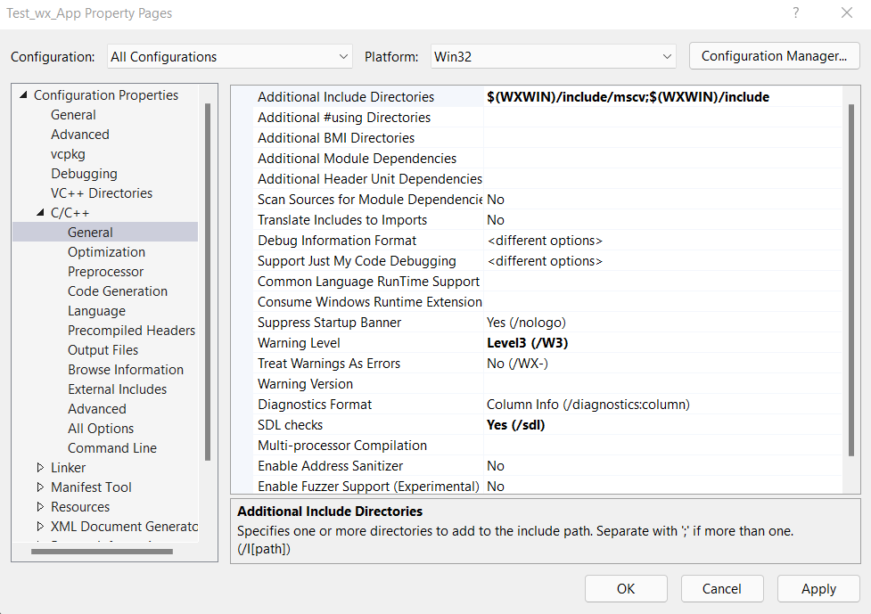
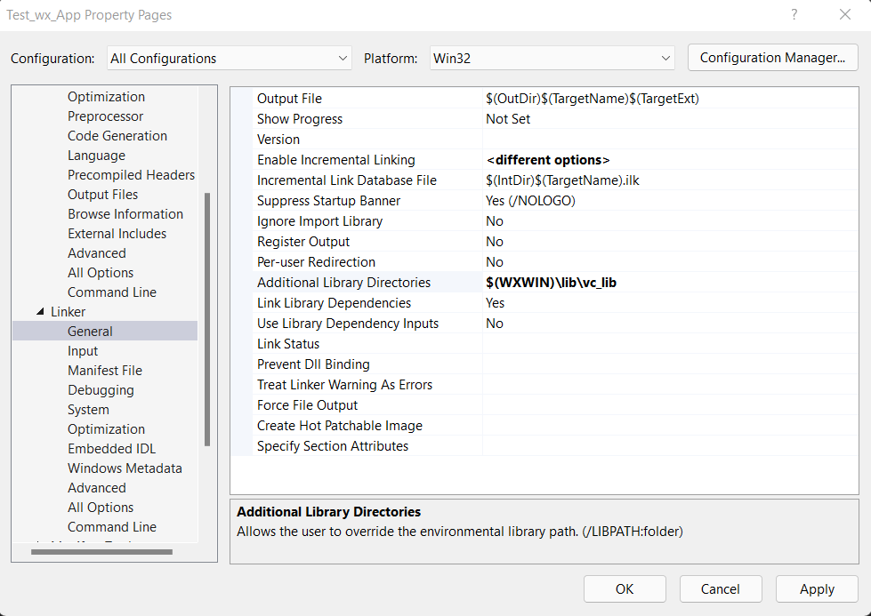
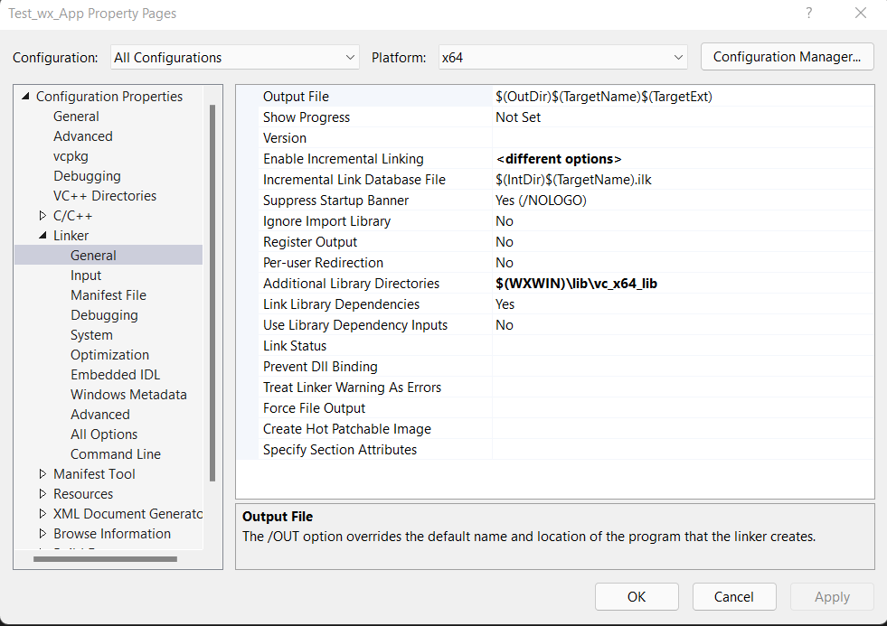
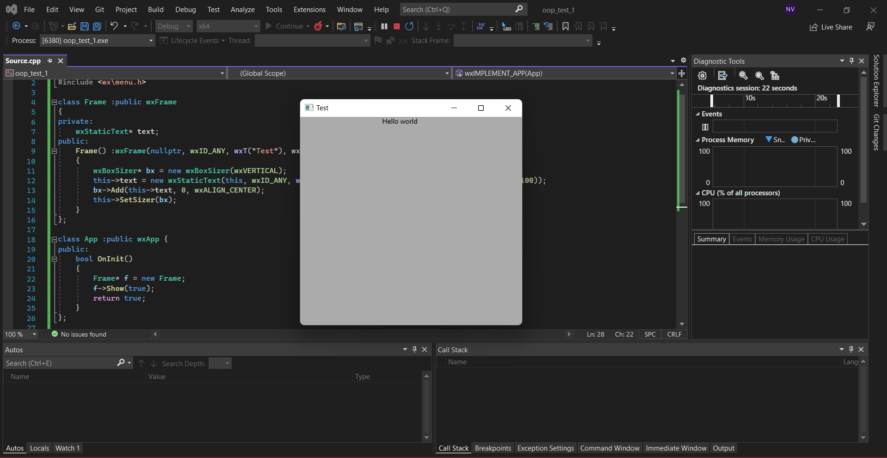

<style>
    img
    {
        width:87%;
    }
</style>


# Μεταγλώττιση των wxwidgets μέσω του Visual Studio 2022

1. Εγκατάσταση Community Edition του visual studio:[Visual Studio Community](https://visualstudio.microsoft.com/thank-you-downloading-visual-studio/?sku=Community&rel=17)

2. Λήψη της βιβλιοθήκης wxwidgets:[wxWidgets-3.1.5](https://github.com/wxWidgets/wxWidgets/releases/download/v3.1.5/wxWidgets-3.1.5.zip)

3. Αποσυμπίεση του φακέλου wxwidgets widgets στον τοπικό δίσκο C του υπολογιστή σας.

    

4. Άνοιγμα του αρχείου wx_vc16.sln, το οποίο βρίσκεται στο ακόλουθο μονοπάτι του υπολογιστή σας:C:\wxWidgets-3.1.5\build\msw\wx_vc16.sln.(Για την έκδοση του 2017 του visual studio επιλέγουμε το αρχείο wx_vc15.sln, ενώ για την έκδοση 2019 επιλέγουμε το αρχείο wx_vc16.sln)

    

5. Επείτα προσθέτουμε την βιβλιοθήκη των wxwidgets στις μεταβλητές συστήματος.

    * Ανοίγω το παράθυρο διαχείρισης μεταβλητών περιβάλλοντος.
        
    

    * Επιλέγω την δημιουργία μίας νέας μεταβλητής συστήματος.
        
    
    * Συμπληρώνω τα πεδία που αντιστοιχουν στο όνομα και στο μονοπάτι της μεταβλητής συστήματος με τον παρακάτω τρόπο.

        

6. Το αρχείο θα ανοίξει ένα παράθυρο στο visual studio το οποίο θα περίέχει το solution explorer του project. Στο block του solution explorer διαλέγω την επιλογή _custom_build και στην συνέχεια από την μπάρα μενού επιλέγω Build->Configuration_Manager. 

    

Έπειτα πρέπει εκκινώ την διαδικασία του  build ολες τις βιβλιοθήκες που είναι διαθέσιμες μέσω των wxwidgets.

   

7. Έπειτα δημιουργώ ένα καινούργιο project και συγκεκριμένα ένα Empty Project.

8. Στο παράθυρο που ανοίγει εμφανίζεται το solution explorer window καθώς και το property manager window. Στο property manager window κάνετε αριστερό κλίκ στον project property manager και επιλέγεται από τις διαθέσιμες επιλογές την επιλογή properties.

    

9.Τέλος πραγματοποιήστε τις παρακάτω αλλαγές.

  * Στο Dropdown menu στην επιλογή platform, επιλέξτε All Platforms

    

  *   Έπειτα από το μενού επιλέγεται Configuration Properties->C/C++->General->Additional Include Directories και αλλάζετε την τιμή του πεδίου Additional Include Directories σε:
    ```
        $(WXWIN)\include\msvc;$(WXWIN)\include
    ```

   

  * Τέλος από το μενού επιλέγεται Configuration Properties->Linker->General->Additional Library Directories και αλλάζουμε την τιμη του σε:
  
    1. Για Platform: Win32
    ```
        $(WXWIN)\lib\vc_lib
    ```
    

    2. Για Platform: x64
    ```
        $(WXWIN)\lib\vc_x64_lib
    ```
    


**!!Τα βήματα 7-9 επαναλαμβάνονται κάθε φορά που θέλω να δημιουργήσω ένα project που θα μεταγλωττίζει την βιβλιοθήκη των wxwidgets**

**!!Δοκιμάστε να να μεταγλωττίσετε και να εκτελέσετε το παρακάτω τμήμα κώδικα στο project σας.**

```
    #include <wx/wx.h>

    class Frame:public wxFrame
    {
        private:
            wxStaticText *text;
        public: 
            Frame():wxFrame(nullptr,wxID_ANY,wxT("Test"),wxDefaultPosition,wxSize(400,400))
            {
                wxBoxSizer *bx=new wxBoxSizer(wxVERTICAL);
                this->text=new wxStaticText(this,wxID_ANY,wxT("Hello world"),wxDefaultPosition,wxSize(100,100));
                bx->Add(this->text,0,wxALIGN_CENTER);
                this->SetSizer(bx);
            }
    };

    class App:public wxApp{
        public:
            bool OnInit()
            {
                Frame *f=new Frame;
                f->Show(true);
                return true;
            }
    };

    wxIMPLEMENT_APP_NO_MAIN(App);
    int main(int argc,char **argv)
    {
        wxEntry(argc,argv);
    }

```

10.Αποτέλεσμα

  
 

## Οδηγίες σε βίντεο

<iframe width="560" height="315" src="https://www.youtube.com/embed/oR6ErgnfymE" title="YouTube video player" frameborder="0" allow="accelerometer; autoplay; clipboard-write; encrypted-media; gyroscope; picture-in-picture" allowfullscreen></iframe>