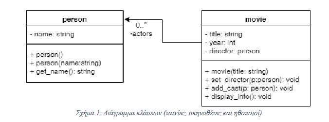
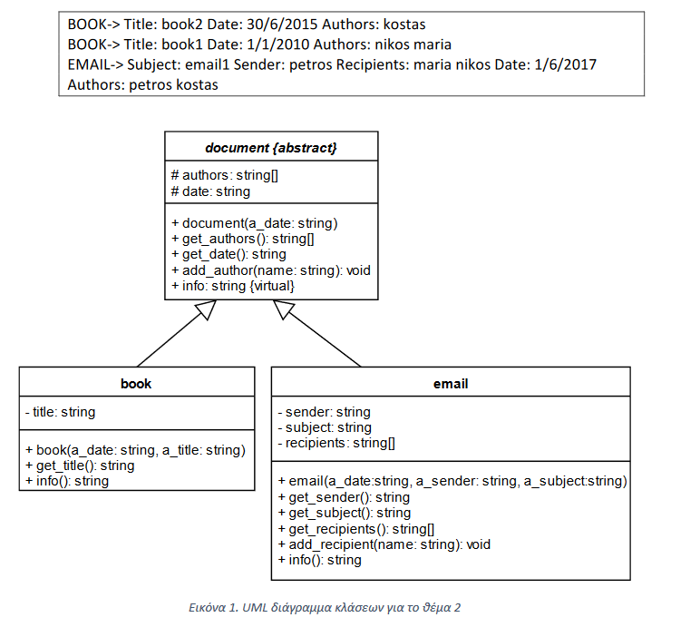

# ΑΝΤΙΚΕΜΕΝΟΣΤΡΑΦΗΣ ΠΡΟΓΡΑΜΜΑΤΙΣΜΟΣ ΘΕΜΑΤΑ ΠΡΟΕΤΟΙΜΑΣΙΑΣ

1. Κατασκευάστε μια κλάσης προτύπου με όνομα Stack που να χρησιμοποιείται
   για τη δημιουργία αντικειμένων στοίβας (λειτουργίες push, pop, top) με
   περιεχομένα τύπου που θα δηλώνει ο προγραμματιστής κατά τη δήλωση των
   αντικειμένων στοίβας. Χρησιμοποιήστε τη στοίβα: α) για να πετύχετε την

   * αντιστροφή ενός λεκτικού
   * για να εισάγετε 10 ακεραίους και συνεχεία να τους εμφανίσετε καθώς θα εξάγονται.
   * μετατροπή ενός αριθμού που εισάγει ο χρήστης σε δυαδικό
2. Δημιουργήστε μια κλάση sphere (σφαίρα) που:
    * Να έχει ως ιδιωτικό μέλος το πεδίο radius (ακτίνα σφαίρας).
    * Να έχει έναν constructor που να ορίζει τo radius.
    * Να διαθέτει getters και setters για το πεδίο radius.
    * Να διαθέτει μια συνάρτηση get_volume που να επιστρέφει τον όγκο της σφαίρας με
    βάση τον τύπο E = 4/3 πr3, όπου r η ακτίνα της σφαίρας.
    * Δημιουργήστε συνάρτηση show που θα εμφανίζει τα στοιχεία ως
    εξής «RADIUS=XXX.XX, VOLUME=YYY.YY», όπου XXX.XX είναι η ακτίνα και ΥΥΥ.ΥΥ είναι ο όγκος της σφαίρας.
    F. Στη main, γράψτε κώδικα που επαναληπτικά να δέχεται από το χρήστη τα στοιχεία 5
    σφαιρών, να εμφανίζει κάθε σφαίρα και τερματίζοντας να
    εμφανίζει το μέσο όρο όγκων από όλες τις σφαίρες.
    
3. Κατασκευάστε τις κλάσεις που δείχνει το ακόλουθο UML διάγραμμα κλάσεων (Σχήμα 1) και οι οποίες
αναπαριστούν ταινίες (movie) που σκηνοθετούνται από ένα άτομο (person) και έχουν ως ηθοποιούς ένα
σύνολο (std::vector) από άτομα. Στη συνέχεια δημιουργήστε 2 αντικείμενα ταινίες με τίτλους “Movie 1” και
“Movie 2”, ορίστε ότι στη ταινία “Movie 1” είναι σκηνοθέτης ο “Director 1” και παίζουν οι ηθοποιοί “Actor
1” και “Actor 2” ενώ στη ταινία “Movie 2” είναι σκηνοθέτης ο “Director 2” και παίζουν οι ηθοποιοί “Actor
2” και “Actor 3”. Εμφανίστε καλώντας τη συνάρτηση μέλος display_info() της κλάσης movie τα στοιχεία της
κάθε ταινίας, δηλαδή τίτλο, σκηνοθέτη και ηθοποιούς.

4. Κατασκευάστε τις κλάσεις που δείχνει το ακόλουθο UML διάγραμμα κλάσεων
(Εικόνα 1) και οι οποίες αναπαριστούν έγγραφα, βιβλία και emails. Αναλυτικότερα,
κατασκευάστε τα ακόλουθα:
    * Κλάσεις - ιεραρχία κλάσεων
    * Κατασκευαστές
    * Getters και συναρτήσεις add_author1 και add_recipient
    * Η συνάρτηση add_author προσθέτει 1 όνομα συγγραφέα στο διάνυσμα των συγγραφέων (authors), η συνάρτηση add_recipient προσθέτει 1 όνομα παραλήπτη στο διάνυσμα των παραληπτών email(recipients)
    * Συνάρτηση info και στις 3 κλάσεις
    * Συναρτηση greater η οποία θα συγκρίνει 2 αντικείμενα με βάση το όνομα του πρώτου συγγραφέα.
Στη main, δημιουργήστε τα ακόλουθα αντικείμενα:
    * Αντικείμενο book: title = “book1”, date = “1/1/2010”, authors = “nikos”,“maria”
    * Αντικείμενο book: title = “book2”, date = “30/6/2015”, authors = “kostas”
    * Αντικείμενο email: sender= “petros”, subject= “email1”, recipients = “maria”,“nikos”,date = “1/6/2017”, authors = “petros”, “kostas”
    * Εισάγετε σε ένα vector<document*> δείκτες προς τα παραπάνω αντικείμενα.
    * Ταξινομήστε τα περιεχόμενα του vector και εμφανίστε τα περιεχόμενα του vector καλώντας τη συνάρτηση info για κάθε αντικείμενο. Τα αποτελέσματα θα πρέπει να εμφανίζονται όπως παρακάτω:

    

5. Κατασκευάστε συνάρτηση που να δέχεται ένα vector με αλφαριθμητικά και να επιστρέφει μόνο αυτά που περιέχουν αριθμούς.

6. Κατασκευάστε ένα πρόγραμμα στην C++ που θα ορίζει δύο vector names και grades. To μέγεθος των δεδομένων θα πρέπει να ορίζεται από τον χρήστη. Το πρόγραμμα θα επιτελει την ακόλουθη λειτουργικότητα:

   * Ο χρήστης θα εισάγει για κάθε φοιτητή το όνομα και τον βαθμό του και θα τα εισάγει στο vector.
   * Να υπολογίζει και να εμφανίζει τον μέσο ορο των βαθμολογιών.
   * Να υπολογίζει και να εμφανίζει την μέση τιμή των βαθμολογίων.
   * Να υπολογιστεί η τυπική απόκλιση των βαθμών.
   * Να υπολογίζει και να εμφανίζει τους φοιτητές που με βαθμολογία στο διάστημα [5-8] και [8-10], καθώς και το ποσοστό των φοιτητών που επέτυχαν στην εξέταση του μαθήματος.
  
7. Να κατασκευάσετε κλάση με όνομα vehicle (όχημα) και τις υποκλάσεις αυτής car (αυτοκίνητο) και truck (φορτηγό).
   Για την κλάση Vehicle ορίστε τα προστατευμένα μέλη δεδομένων registration_number (αριθμός άδειας) και
   owner_name (όνομα ιδιοκτήτη) και cc (κυβικά εκατοστά). Για την κλάση car ορίστε το μέλος δεδομένων
   number_of_doors (αριθμός πορτών) ενώ για την κλάση Truck ορίστε το μέλος δεδομένων max_weight (μέγιστο βάρος
   φόρτωσης).

   * Κατασκευάστε constructors και για τις τρεις κλάσεις έτσι ώστε να αρχικοποιούν όλα τα μέλη δεδομένων που
     διαθέτει η κάθε μια με τιμές παραμέτρων που θα δέχονται.
   * Ορίστε τη virtual συνάρτηση μέλος traffic_tax (τέλη κυκλοφορίας) στην κλάση vehicle.
   * Ορίστε την κλάση vehicle ως abstract τροποποιώντας κατάλληλα τη συνάρτηση traffic_tax.
   * Ορίστε τη συνάρτηση traffic_tax στην κλάση car έτσι ώστε να υπολογίζει τα τέλη κυκλοφορίας ως εξής: για
     αυτοκίνητα μέχρι και 1000 κυβικά εκατοστά τα τέλη είναι 140€ ενώ για πάνω από 1000 κυβικά εκατοστά για
     κάθε συμπληρωμένα πλήρως 100 κυβικά εκατοστά άνω των 1000 κυβικών εκατοστών υπάρχει επιπλέον
     χρέωση 10€ (π.χ. για 1532 κυβ.εκ. η χρέωση είναι 140€ + 5 * 10€ = 190€)
   * Ορίστε τη συνάρτηση traffic_tax στην κλάση truck έτσι ώστε να υπολογίζει τα τέλη κυκλοφορίας ως εξής: για
     φορτηγά με μέγιστο βάρος φόρτωσης μέχρι και 3000 κιλά η χρέωση είναι 300€, για φορτηγά με μέγιστο
     βάρος φόρτωσης μέχρι και 6000 κιλά η χρέωση είναι 400€ και για ακόμα μεγαλύτερα φορτηγά η χρέωση
     είναι 600€.
   * Κατασκευάστε συναρτήσεις to_string για τις κλάσεις Car και Truck

   1. Γράψτε συνάρτηση total_tax που να δέχεται έναν πίνακα 5 θέσεων με δείκτες προς αντικείμενα είτε car είτε
      truck και να επιστρέφει το σύνολο τελών κυκλοφορίας που πρέπει να πληρωθούν από όλα τα οχήματα.
   2. Γράψτε main που:
      * Δηλώνει πίνακα 5 θέσεων που θα έχει τη δυνατότητα να δεχθεί δείκτες προς αντικείμενα είτε car είτε
        truck.
      * Για κάθε ένα από 5 οχήματα να δέχεται τιμές από τον χρήστη έτσι ώστε ο χρήστης να επιλέγει το εάν
        το όχημα που εισάγει είναι αυτοκίνητο ή φορτηγό, εν συνεχεία να δέχεται τα στοιχεία του οχήματος
        και να το τοποθετεί στον πίνακα.
      * Να καλεί τη συνάρτηση total_tax και να εμφανίζει το αποτέλεσμα που επιστρέφει
8. Κατασκευάστε μια κλάση account (λογαριασμός τράπεζας) που να περιέχει τα ιδιωτικά δεδομένα: owner (όνομα ιδιοκτήτη), balance (υπόλοιπο) και type (τύπος λογαριασμού). Ο τύπος λογαριασμού να είναι enum class με όνομα ACCOUNT_TYPE και 3 πιθανές τιμές CHECKING, SAVINGS και MONEY_MARKET.

   * Κατασκευάστε getters και setters για τα ιδιωτικά μέλη δεδομένων της κλάσης account.
   * Ορίστε μια στατική μεταβλητή με όνομα nr_of_accounts που μετρά πόσα αντικείμενα έχουν κατασκευαστεί.
   * Κατασκευάστε έναν constructor που εισάγει τις εξής τιμές: ιδιοκτήτης=Noname, υπόλοιπο=0€, τύπος
     λογαριασμού=CHECKING
   * Κατασκευάστε έναν constructor που να δέχεται 3 παραμέτρους και να αρχικοποιεί με αυτές και τα 3 πεδία
     του προς κατασκευή αντικειμένου.
   * Κατασκευάστε έναν copy constructor που να δημιουργεί ένα αντίγραφο του λογαριασμού αλλά με υπόλοιπο
     μηδέν.
   * Ορίστε τη συνάρτηση deposit(double) (κατάθεση) που προσθέτει στον λογαριασμό ένα ποσό.
   * Ορίστε τη συνάρτηση withdrawal(double) (ανάληψη) που αφαιρεί από τον λογαριασμό ένα ποσό. Αν το ποσό
     είναι μεγαλύτερο από το υπόλοιπο τότε το υπόλοιπο να μηδενίζεται. Η συνάρτηση να επιστρέφει το ποσό
     που αφαιρέθηκε από τον λογαριασμό.
   * Υπερφορτώστε τον τελεστή < έτσι ώστε να διατάσσει δύο αντικείμενα account σύμφωνα με το υπόλοιπό
     τους.
   * Προσθέστε κατάλληλη συνάρτηση μέλος έτσι ώστε να μετατρέπει ένα αντικείμενο account σε string.
   * Κατασκευάστε main που:
     * Δημιουργεί έναν λογαριασμό acc1 με τον default constructor.
     * Δημιουργεί έναν λογαριασμό acc2 με τις τιμές ιδιοκτήτης=Ken Lay, υπόλοιπο=100.000€, τύπος
       λογαριασμού=MONEY_MARKET
     * Δημιουργεί χρησιμοποιώντας τον copy constructor έναν τρίτο λογαριασμό acc3 χρησιμοποιώντας τον
       λογαριασμό acc2.
     * Εμφανίστε το πλήθος των λογαριασμών που έχουν δημιουργηθεί χρησιμοποιώντας την στατική
       μεταβλητή.
     * Πραγματοποιήστε ανάληψη ενός ποσού που θα δίνει ο χρήστης από τον λογαριασμό acc2 και
       κατάθεσή του κατά 80% στο λογαριασμό acc3 και κατά 20% στο λογαριασμό acc1.
     * Εμφανίζει ποιος από τους δύο λογαριασμούς του Ken Lay έχει το μικρότερο υπόλοιπο.
9. Κατασκευάστε μια templated συνάρτηση που να δέχεται ένα διάνυσμα και ένα στοιχείο και να επιστρέφει πόσες φορές υπάρχει το στοιχείο μέσα στο διάνυσμα. Να κληθεί η συνάρτηση:

* Για ένα διάνυσμα ακεραίων.
* Για ένα διάνυσμα πραγματικών.
* Για ένα διάνυσμα με αλφαριθμητικά.

10. Κατασκευάστε μια συνάρτηση που να δέχεται ως παράμετρο ένα διάνυσμα  και θα επιστρέφει τη μεγαλύτερη τιμή του πίνακα. Ο τύπος των στοιχείων που θα περιέχει ο πίνακας θα ορίζεται κατά την κλήση της συνάρτησης. Πραγματοποιήστε κλήση της συνάρτησης για έναν πίνακα ακεραίων, για έναν πίνακα πραγματικών και για έναν πίνακα λεκτικών.
