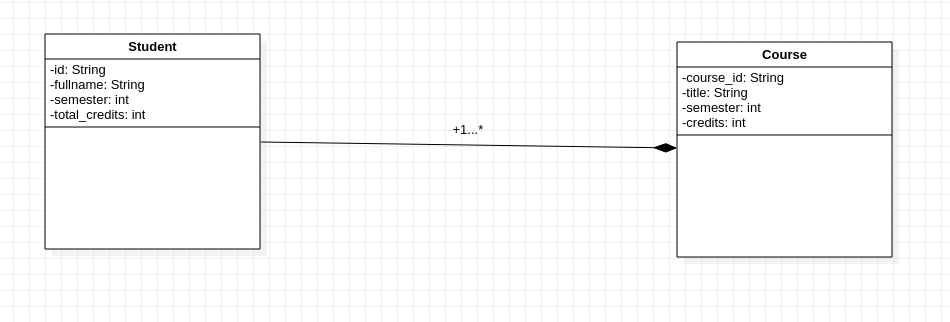

<head>
  <title>Αντικειμενοστραφής Προγραμματισμός</title>

</head>
  
# Αντικειμενοστραφής Προγραμματισμός

**Εξάμηνο 3ο(2021-2022)**

**Ιστοσελίδα Μαθήματος:[:globe_with_meridians:](https://chgogos.github.io/oop/)**

<u>NASTOS VASILEIOS-ARTA:copyright:2021</u>

Τελευταία ενημέρωση:21/11/2021

---

* ## Ενισχυτικά 

  * ### Ενισχυτικό 1(30/10/21)
  
      |                                     **Δείκτες**                                        |
      |----------------------------------------------------------------------------------------|
      |[pointers 1](https://github.com/vasnastos/OOP/blob/main/Lesson_1/Pointers/pointers1.cpp)|
      |[pointers 2](https://github.com/vasnastos/OOP/blob/main/Lesson_1/Pointers/pointers2.cpp)|
      |[pointers 3](https://github.com/vasnastos/OOP/blob/main/Lesson_1/Pointers/pointers3.cpp)|
    
    |                                     **Αναφορές**                                                    |
    |-----------------------------------------------------------------------------------------------------|
    |[reference 1](https://github.com/vasnastos/OOP/blob/main/Lesson_1/References/pass_by_reference1.cpp) |
    |[reference 2](https://github.com/vasnastos/OOP/blob/main/Lesson_1/References/pass_by_reference2.cpp) |
    |[reference 3](https://github.com/vasnastos/OOP/blob/main/Lesson_1/References/pass_by_reference3.cpp) |
    |[pass_by_value 1](https://github.com/vasnastos/OOP/blob/main/Lesson_1/References/pass_by_value1.cpp) | 
     
    |                                   **Αλφαριθμητικά**                                             |
    |-------------------------------------------------------------------------------------------------|
    |  [strings 1](https://github.com/vasnastos/OOP/blob/main/Lesson_1/string.cpp)                    |
    |  [strings 2](https://github.com/vasnastos/OOP/blob/main/Lesson_1/Word_Counter/word_counter.cpp) |
    
   * ### Ενισχυτικό 2(07/11/21)
   
     |                              **Δομές(Structs)**                                      |
     |--------------------------------------------------------------------------------------|
     |  [structs1](https://github.com/vasnastos/OOP/blob/main/Lesson_2/Structs/struct1.cpp) |
     |  [structs2](https://github.com/vasnastos/OOP/blob/main/Lesson_2/Structs/struct2.cpp) |
     |  [structs3](https://github.com/vasnastos/OOP/blob/main/Lesson_2/Structs/struct3.cpp) |
     
     |                              **Containers**                                                      |
     |--------------------------------------------------------------------------------------------------|
     |   [shuffle](https://github.com/vasnastos/OOP/blob/main/Lesson_2/Vectors/vector1.cpp)             |
     |   [vector methods](https://github.com/vasnastos/OOP/blob/main/Lesson_2/Vectors/vector2.cpp)      |
     |   [vector sort](https://github.com/vasnastos/OOP/blob/main/Lesson_2/Vectors/vector3.cpp)         |
     |   [vector with pairs](https://github.com/vasnastos/OOP/blob/main/Lesson_2/Vectors/vector4.cpp)   |
     |   [vector methods](https://github.com/vasnastos/OOP/blob/main/Lesson_2/Vectors/vector5.cpp)      |
     |   [vector shuffle](https://github.com/vasnastos/OOP/blob/main/Lesson_2/Vectors/vector6.cpp)      |
     |   [vector iterators](https://github.com/vasnastos/OOP/blob/main/Lesson_2/Vectors/vector7.cpp)    |
     |   [vector with pairs(2)](https://github.com/vasnastos/OOP/blob/main/Lesson_2/Vectors/vector8.cpp)|
     |   [map1](https://github.com/vasnastos/OOP/blob/main/Lesson_2/Maps/map1.cpp)                      |
     
     |                                **Τυχαιότητα-Ορίσματα Γραμμής εντολών**                 |
     |----------------------------------------------------------------------------------------|
     |   [random1](https://github.com/vasnastos/OOP/blob/main/Lesson_2/Random/random1.cpp)    |
     |   [random2](https://github.com/vasnastos/OOP/blob/main/Lesson_2/Random/random2.cpp)    |
     |   [random3](https://github.com/vasnastos/OOP/blob/main/Lesson_2/Random/random3.cpp)    |
     |   [cla](https://github.com/vasnastos/OOP/blob/main/Lesson_2/command_line_arguments.cpp)|
    
    * ### Ενισχυτικό 3(13/11/21) 
      
      [**ΠΑΡΟΥΣΙΑΣΗ**:spiral_notepad:](https://github.com/vasnastos/OOP/blob/main/Lesson_3/OOP_3.pdf)
      
        | **ΑΣΚΗΣΗ** |                               **ΛΥΣΗ**                                                  |
        |------------|-----------------------------------------------------------------------------------------|
        |  ΑΣΚ_1     | [**:paperclips:**](https://github.com/vasnastos/OOP/blob/main/Lesson_3/exercise1.cpp)   |
        |  AΣΚ_2     | [**:paperclips:**](https://github.com/vasnastos/OOP/blob/main/Lesson_3/exercise2.cpp)   |
        |  ΑΣΚ_3     | [**:paperclips:**](https://github.com/vasnastos/OOP/blob/main/Lesson_3/exercise3.cpp)   |
        |  ΑΣΚ_4     | [**:paperclips:**](https://github.com/vasnastos/OOP/blob/main/Lesson_3/exercise4.cpp)   |
        |  ΑΣΚ_5     | [**:paperclips:**](https://github.com/vasnastos/OOP/blob/main/Lesson_3/exercise5.cpp)   |
        |  ΑΣΚ_6     | [**:paperclips:**](https://github.com/vasnastos/OOP/blob/main/Lesson_3/exercise6.cpp)   |
        |  ΑΣΚ_7     | [**:paperclips:**](https://github.com/vasnastos/OOP/blob/main/Lesson_3/exercise7.cpp)   |
        
  * ## ΕΡΓΑΣΙΕΣ 

    * **Εργασία 1**
   
        <iframe style="width:90%; height:750px;" src="Read_Me(resources)/2021f_oop_prj1.pdf"></iframe>  

        **Τμήματα κώδικα(17/11/21)**
        
         * [horse.hpp](https://github.com/vasnastos/OOP/blob/main/Assignment_1/OOP_ASSIGN_17_11/horse.hpp)
         * [horse.cpp](https://github.com/vasnastos/OOP/blob/main/Assignment_1/OOP_ASSIGN_17_11/horse.cpp)
         * [racing.hpp](https://github.com/vasnastos/OOP/blob/main/Assignment_1/OOP_ASSIGN_17_11/racing.hpp)
         * [racing.cpp](https://github.com/vasnastos/OOP/blob/main/Assignment_1/OOP_ASSIGN_17_11/racing.cpp)
         * [horse_race.cpp](https://github.com/vasnastos/OOP/blob/main/Assignment_1/OOP_ASSIGN_17_11/horse_race.cpp)
         * [tests.cpp](https://github.com/vasnastos/OOP/blob/main/Assignment_1/OOP_ASSIGN_17_11/test_class.cpp)  
         
        **Τμήματα Κώδικα(20/11/21)**
         * [horse.hpp](https://github.com/vasnastos/OOP/blob/main/Assignment_1/OOP_EXTRA/horse.hpp)
         * [horse.cpp](https://github.com/vasnastos/OOP/blob/main/Assignment_1/OOP_EXTRA/horse.cpp)
         * [racing.hpp](https://github.com/vasnastos/OOP/blob/main/Assignment_1/OOP_EXTRA/racing.hpp)
         * [racing.cpp](https://github.com/vasnastos/OOP/blob/main/Assignment_1/OOP_EXTRA/racing.cpp)
         * [horse_race.cpp](https://github.com/vasnastos/OOP/blob/main/Assignment_1/OOP_EXTRA/horse_race.cpp)
         * [tests.cpp](https://github.com/vasnastos/OOP/blob/main/Assignment_1/OOP_EXTRA/test_class.cpp)
         * [horse_race_bet.cpp](https://github.com/vasnastos/OOP/blob/main/Assignment_1/OOP_EXTRA/horse_race_bet.cpp)  
        
        :bangbang:[**H βιβλιοθήκη της catch**](https://github.com/vasnastos/OOP/blob/main/Assignment_1/catch.hpp)
        
        :bangbang:[**Επίλυση Εργασίας**](results_assignment_1.md)
        
    * **Εργασία 2**
       
       <iframe width="90%" height="750px" src="Read_Me(resources)/2021f_oop_prj2.pdf">
  
      **Διάγραμμα κλάσεων**
  
      
      
 * ## ΟΔΗΓΙΕΣ ΕΓΚΑΤΑΣΤΑΣΗΣ
      * [sqlite](sqlite.md)
  
