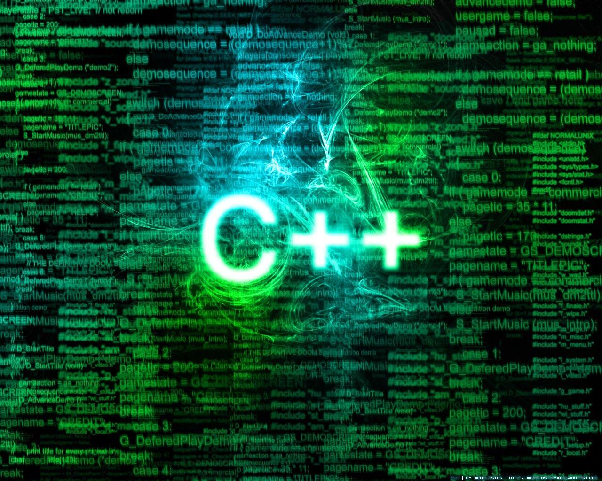

<head>
  <meta name="viewport" content="width=device-width, initial-scale=1">
  <link rel="stylesheet" href="https://www.w3schools.com/w3css/4/w3.css">
  <link href="https://fonts.googleapis.com/css2?family=Cinzel&display=swap" rel="stylesheet">

<!-- Bootstrap CDN -->
  <link rel="stylesheet" href="http://netdna.bootstrapcdn.com/bootstrap/3.1.1/css/bootstrap.min.css">
    <script src="http://code.jquery.com/jquery-1.11.0.min.js"></script>
    <script src="http://netdna.bootstrapcdn.com/bootstrap/3.1.1/js/bootstrap.min.js"></script>
  <title>Αντικειμενοστραφής Προγραμματισμός</title>
<style>
  table{
   text-align:center;
  font-size:11px;
  font-weight:bold;
  width:80%;
 }
  tr:hover
  {
    font-size:13px;
    background-color:#d9d0db;
    color:#161f40;
    text-decoration:underline;
  }

  .ico
  {
     width:90px;
     height:50px;
  }

  .ricon
  {
     border-radius:50%;
     height:100px;
     width:100px;
  }
  
  .hovertext {
  position: relative;
}

.hovertext:before {
  content: attr(data-hover);
  visibility: hidden;
  opacity: 0;
  width: 140px;
  background-color: black;
  color: #fff;
  text-align: center;
  border-radius: 5px;
  padding: 5px 0;
  transition: opacity 1s ease-in-out;

  position: absolute;
  z-index: 1;
  left: 0;
  top: 110%;
}

.hovertext:hover:before {
  opacity: 1;
  visibility: visible;
}

.btn {
  width: width:20%;
  height: auto;
  border: 1px solid #333;
  font-family: 'Cinzel', serif;
  font-size: 20px;
  cursor: pointer;
  -webkit-tap-highlight-color: transparent;
  display: flex;
  align-items: center;
  justify-content: center;
  position: relative;
  z-index: 0;
  transition: 1s;
}

.btn::before, .btn::after {
  position: absolute;
  background:transparent;
  z-index: -1;
  transition: 1s;
  content: '';
}

.btn::before {
  height: 50px;
  width: 130px;
}

.btn::after {
  width: 150px;
  height: 30px;
}

.noselect {
  -webkit-touch-callout: none;
    -webkit-user-select: none;
     -khtml-user-select: none;
       -moz-user-select: none;
        -ms-user-select: none;
            user-select: none;
}

.btn:hover::before {
  width: 0px;
  background: #fff;
}

.btn:hover::after {
  height: 0px;
  background: #fff;
}

.btn:hover {
  background: #fff;
}

<!-- Collapsible -->
button
{
  background-color:transparent;
}
.collapsible {
  background-color: white;
  color:white;
  cursor: pointer;
  border:none;
  border-radius: 50%;
  text-align: left;
  outline: none;
  font-size: 15px;
   box-shadow: 0 6px 6px rgba(0, 0, 0, 0.6);
}

.active, .collapsible:hover {
  background-color: blue;
}

.content {
  padding: 0 18px;
  display: none;
  overflow: hidden;
  background-color: #f1f1f1;
}
</style>
<script>
  function details() {
  var coll = document.getElementsByClassName("collapsible");
  var i;

  for (i = 0; i < coll.length; i++) {
  coll[i].addEventListener("click", function() {
    this.classList.toggle("active");
    var content = this.nextElementSibling;
    if (content.style.display === "block") {
      content.style.display = "none";
    } else {
      content.style.display = "block";
    }
  });
  }
  }
</script>
</head>
  
# Αντικειμενοστραφής Προγραμματισμός

<center>
<button class="collapsible" onclick="details()"></button>
<div class="content">
  <span style="display:inline;">
  <span class="hovertext" data-hover="Εξαμηνο Τρίτο">
  
  </span>

  <a href="https://chgogos.github.io/oop/"></a>


  <span class="hovertext" data-hover="NASTOS VASILEIOS-ARTA-2021">
  
  </span>


  <span class="hovertext" data-hover="Τελευταία ενημέρωση:13/01/2022">
  
  </span>
  </span>
</div>
</center>
<br><br>


---

## Ενισχυτικά 
 
### Ενισχυτικό 1(30/10/21)
:heavy_check_mark:[pointers1.cpp](https://github.com/vasnastos/OOP/blob/main/Lesson_1/Pointers/pointers1.cpp)
  
:heavy_check_mark:[pointers 2](https://github.com/vasnastos/OOP/blob/main/Lesson_1/Pointers/pointers2.cpp)

:heavy_check_mark:[pointers 3](https://github.com/vasnastos/OOP/blob/main/Lesson_1/Pointers/pointers3.cpp)

:heavy_check_mark:[reference 1](https://github.com/vasnastos/OOP/blob/main/Lesson_1/References/pass_by_reference1.cpp) 

:heavy_check_mark:[reference 2](https://github.com/vasnastos/OOP/blob/main/Lesson_1/References/pass_by_reference2.cpp) 

:heavy_check_mark:[reference 3](https://github.com/vasnastos/OOP/blob/main/Lesson_1/References/pass_by_reference3.cpp) 

:heavy_check_mark:[pass_by_value 1](https://github.com/vasnastos/OOP/blob/main/Lesson_1/References/pass_by_value1.cpp)  
  

:heavy_check_mark:[strings 1](https://github.com/vasnastos/OOP/blob/main/Lesson_1/string.cpp)        

:heavy_check_mark:[strings 2](https://github.com/vasnastos/OOP/blob/main/Lesson_1/Word_Counter/word_counter.cpp) 

### Ενισχυτικό 2(07/11/21)
:heavy_check_mark:[structs1](https://github.com/vasnastos/OOP/blob/main/Lesson_2/Structs/struct1.cpp) 

:heavy_check_mark:[structs2](https://github.com/vasnastos/OOP/blob/main/Lesson_2/Structs/struct2.cpp)

:heavy_check_mark:[structs3](https://github.com/vasnastos/OOP/blob/main/Lesson_2/Structs/struct3.cpp)

:heavy_check_mark:[shuffle](https://github.com/vasnastos/OOP/blob/main/Lesson_2/Vectors/vector1.cpp)

:heavy_check_mark:[vector methods](https://github.com/vasnastos/OOP/blob/main/Lesson_2/Vectors/vector2.cpp)

:heavy_check_mark:[vector sort](https://github.com/vasnastos/OOP/blob/main/Lesson_2/Vectors/vector3.cpp)

:heavy_check_mark:[vector with pairs](https://github.com/vasnastos/OOP/blob/main/Lesson_2/Vectors/vector4.cpp)

:heavy_check_mark:[vector methods](https://github.com/vasnastos/OOP/blob/main/Lesson_2/Vectors/vector5.cpp) 

:heavy_check_mark:[vector shuffle](https://github.com/vasnastos/OOP/blob/main/Lesson_2/Vectors/vector6.cpp)

:heavy_check_mark:[vector iterators](https://github.com/vasnastos/OOP/blob/main/Lesson_2/Vectors/vector7.cpp)

:heavy_check_mark:[vector with pairs(2)](https://github.com/vasnastos/OOP/blob/main/Lesson_2/Vectors/vector8.cpp)

:heavy_check_mark:[map1](https://github.com/vasnastos/OOP/blob/main/Lesson_2/Maps/map1.cpp)              

:heavy_check_mark:[random1](https://github.com/vasnastos/OOP/blob/main/Lesson_2/Random/random1.cpp)  

:heavy_check_mark:[random2](https://github.com/vasnastos/OOP/blob/main/Lesson_2/Random/random2.cpp)

:heavy_check_mark:[random3](https://github.com/vasnastos/OOP/blob/main/Lesson_2/Random/random3.cpp)    

:heavy_check_mark:[command line arguments](https://github.com/vasnastos/OOP/blob/main/Lesson_2/command_line_arguments.cpp)
    
### Ενισχυτικό 3(13/11/21) 
      
  [**ΠΑΡΟΥΣΙΑΣΗ**:spiral_notepad:](https://github.com/vasnastos/OOP/blob/main/Lesson_3/OOP_3.pdf)
      
  :heavy_check_mark:[ΑΣΚΗΣΗ 1](https://github.com/vasnastos/OOP/blob/main/Lesson_3/exercise1.cpp) 

  :heavy_check_mark:[ΑΣΚΗΣΗ 2](https://github.com/vasnastos/OOP/blob/main/Lesson_3/exercise2.cpp)   

  :heavy_check_mark:[ΑΣΚΗΣΗ 3](https://github.com/vasnastos/OOP/blob/main/Lesson_3/exercise3.cpp)   

  :heavy_check_mark:[ΑΣΚΗΣΗ 4](https://github.com/vasnastos/OOP/blob/main/Lesson_3/exercise4.cpp)

  :heavy_check_mark:[ΑΣΚΗΣΗ 5](https://github.com/vasnastos/OOP/blob/main/Lesson_3/exercise5.cpp)  

  :heavy_check_mark:[ΑΣΚΗΣΗ 6](https://github.com/vasnastos/OOP/blob/main/Lesson_3/exercise6.cpp) 

  :heavy_check_mark:[ΑΣΚΗΣΗ 7](https://github.com/vasnastos/OOP/blob/main/Lesson_3/exercise7.cpp)  
     
### Ενισχυτικό 4(20/11/21)
  :heavy_check_mark:Σχετικά με την εργασία:bangbang: Δείτε στο τμήμα **ΕΡΓΑΣΙΕΣ**->Εργασία 1
     
### Ενισχυτικό 5(27/11/21)
  :heavy_check_mark:[Ασκήσης επανάληψης σε σχέση με την πρόοδο](presentation.md)

### Ενισχυτικό 6(08/12/21)
  :heavy_check_mark:[Φυλλάδιο ερωτήσεων επανάληψης σχετικά με την πρόοδο](https://github.com/vasnastos/OOP/blob/main/Lesson_6/oop_proodos.pdf)
    
### Ενισχυτικό 7(12/11/21)
 :heavy_check_mark:[employees example](https://github.com/vasnastos/OOP/blob/main/Lesson_7/employees.cpp)

 :heavy_check_mark:[find algorithm example](https://github.com/vasnastos/OOP/blob/main/Lesson_7/find_explaination.cpp)

 :heavy_check_mark:[erase from vector example](https://github.com/vasnastos/OOP/blob/main/Lesson_7/erase_explaination.cpp)

 :heavy_check_mark:[algorithms example](https://github.com/vasnastos/OOP/blob/main/Lesson_7/algorithms.cpp)

 :heavy_check_mark:[readutf8_chars_example](https://github.com/vasnastos/OOP/blob/main/Lesson_7/readutf8.cpp)

 :heavy_check_mark:[lambdas](https://github.com/vasnastos/OOP/blob/main/Lesson_7/lambdas.cpp)

 :heavy_check_mark:[lambdas combine with vector](https://github.com/vasnastos/OOP/blob/main/Lesson_7/lambdas_combine_with_vectors.cpp)


:pushpin:Κατασκευη παραθύρου με χρήση του framework των wxwidgets
  ```
      #include <wx/wx.h>

      class Frame:public wxFrame{
          public:
              Frame():wxFrame(nullptr,wxID_ANY,wxT("Hello world app"),wxDefaultPosition,wxSize(500,500))
              {
                  wxStaticText *text=new wxStaticText(this,wxID_ANY,wxT("Hello world"),wxDefaultPosition,wxSize(200,40));
                  wxBoxSizer *bx=new wxBoxSizer(wxVERTICAL);
                  bx->AddSpacer(20);
                  bx->Add(text,0,wxALIGN_CENTER);
                  this->SetSizer(bx);
              }
      };

      class App:public wxApp{
          public:
              bool OnInit()
              {
                  Frame *f=new Frame;
                  f->Show();
                  return true;
              }
      };

      wxIMPLEMENT_APP(App);
  ```

  <br>

:pushpin:Παράδειγμα με βαθμoλoγίες φοιτητών και χρήση λίστας
  ```
      #include <wx/wx.h>
      #include <wx/listctrl.h>
      #include <algorithm>
      #include <random>
      #include <chrono>
      #include <vector>
      #include <numeric>

      struct  Student
      {
        int id;
        std::string name;
        std::vector <double> grades;
        Student(int i, std::string n) :id(i), name(n) {}
        void add_grade(double gr)
        {
          this->grades.push_back(gr);
        }
        double average()
        {
          double s = 0.0;
          for (auto& g : this->grades)
          {
            s += g;
          }
          return s/this->grades.size();
        }
      };

      class Frame :public wxFrame
      {
      private:
        wxListCtrl* ctrl;
        std::vector <Student> students;
      public:
        Frame() :wxFrame(nullptr, wxID_ANY, wxT("LIST EXAMPLE"), wxDefaultPosition, wxSize(500, 500))
        {
          wxBoxSizer* bx = new wxBoxSizer(wxVERTICAL);
          this->ctrl = new wxListCtrl(this, wxID_ANY, wxDefaultPosition, wxSize(400, 400), wxLC_REPORT);
          this->ctrl->InsertColumn(0, wxT("Student Name"), wxLIST_FORMAT_CENTER, this->ctrl->GetSize().GetWidth() / 2);
          this->ctrl->InsertColumn(1, wxT("Student id"), wxLIST_FORMAT_CENTER, this->ctrl->GetSize().GetWidth() / 2);
          this->ctrl->SetFont(wxFont(12, wxFONTFAMILY_ROMAN, wxFONTSTYLE_NORMAL, wxFONTWEIGHT_BOLD));
          wxPanel* panel = new wxPanel(this,wxID_ANY);
          wxBoxSizer* ps = new wxBoxSizer(wxHORIZONTAL);
          wxButton* b = new wxButton(panel, wxID_ANY, wxT("Create"), wxDefaultPosition, wxSize(80, 30));
          wxButton* b1 = new wxButton(panel, wxID_ANY, wxT("Show"), wxDefaultPosition, wxSize(80, 30));
          
          b->Bind(wxEVT_COMMAND_BUTTON_CLICKED,&Frame::open,this);
          b1->Bind(wxEVT_COMMAND_BUTTON_CLICKED, &Frame::showst, this);
          wxBoxSizer* panelsizer = new wxBoxSizer(wxHORIZONTAL);
          panelsizer->Add(b, 0, wxALIGN_CENTER);
          panelsizer->AddSpacer(10);
          panelsizer->Add(b1, 0, wxALIGN_CENTER);
          panelsizer->AddSpacer(10);
          panel->SetSizer(panelsizer);
          bx->Add(panel, 0, wxALIGN_CENTER);
          bx->AddSpacer(20);
          bx->Add(this->ctrl, 0, wxALIGN_CENTER);
          this->SetSizer(bx);
        }

        void open(wxCommandEvent& ev)
        {
          this->students.clear();
          std::mt19937 mt(std::chrono::high_resolution_clock::now().time_since_epoch().count());
          auto size=std::uniform_int_distribution<int>(50, 100);
          auto totallessons = std::uniform_int_distribution<int>(5, 9);
          auto grade = std::uniform_real_distribution<double>(0.1, 10.0);
          const int studentsnum = size(mt);
          for (int i = 0; i < studentsnum; i++)
          {
            Student s(i, "Student_" + std::to_string(i));
            const int ln = totallessons(mt);
            for (int j = 0; j < ln; j++)
            {
              s.add_grade(grade(mt));
            }
            this->students.push_back(s);
          }
          int counter = 0;
          for (auto& student : this->students)
          {
            wxListItem it;
            it.SetAlign(wxLIST_FORMAT_CENTER);
            this->ctrl->InsertItem(counter,it);

            this->ctrl->SetItem(counter, 0, wxString(std::to_string(student.id)));
            this->ctrl->SetItem(counter, 1, wxString(student.name));
            counter++;
          }
        }

        void showst(wxCommandEvent &ev)
        {
          auto item = this->ctrl->GetNextItem(-1,wxLIST_NEXT_ALL,wxLIST_STATE_SELECTED);
          auto id = std::stoi(std::string(this->ctrl->GetItemText(item)));
          auto students_itr = std::find_if(this->students.begin(), this->students.end(), [&](const Student& s) {return s.id == id; });
          std::string message = "Student Selected:"+students_itr->name+"\nGrades\n******\n";
          for (auto& gr : students_itr->grades)
          {
            message += "Grade:" + std::to_string(gr) + "\n";
          }
          message += "------\nAverage:" + std::to_string(students_itr->average());
          wxMessageBox( wxString(message), wxT("Show Average"), wxICON_INFORMATION);
        }
      };

      class App :public wxApp
      {
      public:
        bool OnInit()wxOVERRIDE
        {
          Frame* f = new Frame;
          f->Show(true);
          return true;
        }
      };

      wxIMPLEMENT_APP_NO_MAIN(App);
      int main(int argc,char **argv)
      {
        wxEntry(argc, argv);
      }
  ```
  <br>

:pushpin:Παράδειγμα διαγραφής στοιχείου από λίστα.

  ```
      #include <wx/wx.h>
      #include <wx/listctrl.h>
      #include <wx/textctrl.h>
      #include <algorithm>
      #include <sstream>
      #include <random>
      #include <chrono>
      #include <vector>
      #include <iostream>
      #include <string>
      #include <fstream>
      #pragma execution_character_set("utf-8")

      using namespace std;

      class Frame :public wxFrame
      {
      private:
        wxListCtrl* ctrl;
        wxButton* b;
      public:
        Frame() :wxFrame(nullptr, wxID_ANY, wxT("ΠΑΡΑΔΕΙΓΜΑ ΧΡΗΣΗΣ ΛΙΣΤΑΣ"), wxDefaultPosition, wxSize(500, 500))
        {
          wxBoxSizer* bx = new wxBoxSizer(wxVERTICAL);
          bx->AddSpacer(15);
          this->ctrl = new wxListCtrl(this, wxID_ANY, wxDefaultPosition, wxSize(400, 200), wxLC_REPORT);
          this->ctrl->InsertColumn(0, wxT("ΑΡΙΘΜΟΣ"),wxLIST_FORMAT_CENTER,this->ctrl->GetSize().GetWidth());
          this->b = new wxButton(this, wxID_ANY, wxT("DELETE"), wxDefaultPosition, wxSize(70, 30));
          this->b->Bind(wxEVT_COMMAND_BUTTON_CLICKED, &Frame::del, this);
          bx->Add(this->ctrl, 0, wxALIGN_CENTER);
          bx->AddSpacer(30);
          bx->Add(this->b, 0, wxALIGN_CENTER);
          this->fill_list();
          this->SetSizer(bx);
        }

        void fill_list()
        {
          const int number = 101;
          srand(time(nullptr));
          for (int i = 0; i < 10; i++)
          {
            wxListItem it;
            it.SetAlign(wxLIST_FORMAT_CENTER);
            this->ctrl->InsertItem(i,it);

            this->ctrl->SetItem(i, 0, wxString(std::to_string(rand() % number)));
          }
        }

        void del(wxCommandEvent& ev)
        {
          auto it=this->ctrl->GetNextItem(-1, wxLIST_NEXT_ALL, wxLIST_STATE_SELECTED);
          this->ctrl->DeleteItem(it);
        }
      };

      class App :public wxApp
      {
      public:
        bool OnInit()wxOVERRIDE
        {
          Frame* f = new Frame;
          f->Show(true);
          return true;
        }
      };

      wxIMPLEMENT_APP_NO_MAIN(App);
      int main(int argc,char **argv)
      {
        wxEntry(argc, argv);
      }
  ```

### Ενισχυτικό 8

  :heavy_check_mark:**Παραδείγματα STL:**[stl.md](stl.md)
  
  :heavy_check_mark:[inheritance1.cpp](https://github.com/vasnastos/OOP/blob/main/Lesson_8/inheritance1.cpp)

  :heavy_check_mark:[inherictance2.cpp](https://github.com/vasnastos/OOP/blob/main/Lesson_8/inheritance2.cpp)

  :heavy_check_mark:[template1.cpp](https://github.com/vasnastos/OOP/blob/main/Lesson_8/template1.cpp)

  :heavy_check_mark:[template2.cpp](https://github.com/vasnastos/OOP/blob/main/Lesson_8/template2.cpp)

  :heavy_check_mark:[lambdas1.cpp](https://github.com/vasnastos/OOP/blob/main/Lesson_8/lambda.cpp)

  :heavy_check_mark:[map1.cpp](https://github.com/vasnastos/OOP/blob/main/Lesson_8/map1.cpp)

  :heavy_check_mark:[map2.cpp](https://github.com/vasnastos/OOP/blob/main/Lesson_8/map2.cpp)
   
  :heavy_check_mark:[map3.cpp](https://github.com/vasnastos/OOP/blob/main/Lesson_8/map3.cpp)

  :heavy_check_mark:[set1.cpp](https://github.com/vasnastos/OOP/blob/main/Lesson_8/set1.cpp)

  :heavy_check_mark:[set2.cpp](https://github.com/vasnastos/OOP/blob/main/Lesson_8/set2.cpp)

  :heavy_check_mark:[algorithm1.cpp](https://github.com/vasnastos/OOP/blob/main/Lesson_8/algorithm1.cpp)

  :heavy_check_mark:[algorithm2.cpp](https://github.com/vasnastos/OOP/blob/main/Lesson_8/algorithm2.cpp)

## ΕΡΓΑΣΙΕΣ 

  * **Εργασία 1**
  
      <iframe style="width:90%; height:750px;" src="Read_Me(resources)/2021f_oop_prj1.pdf"></iframe>  

    **Τμήματα κώδικα(17/11/21)**
      
      * [horse.hpp](https://github.com/vasnastos/OOP/blob/main/Assignment_1/OOP_ASSIGN_17_11/horse.hpp)
      * [horse.cpp](https://github.com/vasnastos/OOP/blob/main/Assignment_1/OOP_ASSIGN_17_11/horse.cpp)
      * [racing.hpp](https://github.com/vasnastos/OOP/blob/main/Assignment_1/OOP_ASSIGN_17_11/racing.hpp)
      * [racing.cpp](https://github.com/vasnastos/OOP/blob/main/Assignment_1/OOP_ASSIGN_17_11/racing.cpp)
      * [horse_race.cpp](https://github.com/vasnastos/OOP/blob/main/Assignment_1/OOP_ASSIGN_17_11/horse_race.cpp)
      * [tests.cpp](https://github.com/vasnastos/OOP/blob/main/Assignment_1/OOP_ASSIGN_17_11/test_class.cpp)  
        
    **Τμήματα Κώδικα(20/11/21)**
      * [horse.hpp](https://github.com/vasnastos/OOP/blob/main/Assignment_1/OOP_EXTRA/horse.hpp)
      * [horse.cpp](https://github.com/vasnastos/OOP/blob/main/Assignment_1/OOP_EXTRA/horse.cpp)
      * [racing.hpp](https://github.com/vasnastos/OOP/blob/main/Assignment_1/OOP_EXTRA/racing.hpp)
      * [racing.cpp](https://github.com/vasnastos/OOP/blob/main/Assignment_1/OOP_EXTRA/racing.cpp)
      * [horse_race.cpp](https://github.com/vasnastos/OOP/blob/main/Assignment_1/OOP_EXTRA/horse_race.cpp)
      * [tests.cpp](https://github.com/vasnastos/OOP/blob/main/Assignment_1/OOP_EXTRA/test_class.cpp)
      * [horse_race_bet.cpp](https://github.com/vasnastos/OOP/blob/main/Assignment_1/OOP_EXTRA/horse_race_bet.cpp)  
    
      :bangbang:[**H βιβλιοθήκη της catch**](https://github.com/vasnastos/OOP/blob/main/Assignment_1/catch.hpp)
      
      :bangbang:[**Επίλυση Εργασίας**](assignment_1_solution.md)
      
  * **Εργασία 2**
      
      <iframe width="90%" height="750px" src="Read_Me(resources)/2021f_oop_prj2.pdf"></iframe>

    **Δεδομένα προβλήματος**
    ```
      ΚΩΔΙΚΟΣ,ΕΞΑΜΗΝΟ,ΜΑΘΗΜΑ,ΔΙΔΑΚΤΙΚΕΣ ΜΟΝΑΔΕΣ
      101,1,ΓΡΑΜΜΙΚΗ ΑΛΓΕΒΡΑ,5
      102,1,ΜΑΘΗΜΑΤΙΚΗ ΑΝΑΛΥΣΗ,7
      103,1,ΠΡΟΓΡΑΜΜΑΤΙΣΜΟΣ Ι,7
      104,1,ΛΟΓΙΚΗ ΣΧΕΔΙΑΣΗ,5
      105,1,ΗΛΕΚΤΡΟΝΙΚΗ,6
      201,2,ΑΡΧΕΣ ΗΛΕΚΤΡΟΜΑΓΝΗΤΙΣΜΟΥ & ΤΗΛΕΠΙΚΟΙΝΩΝΙΩΝ,6
      202,2,ΠΡΩΤΟΚΟΛΛΑ ΚΑΙ ΑΡΧΙΤΕΚΤΟΝΙΚEΣ ΔΙΚΤΥΩΝ,6
      203,2,ΔΙΑΚΡΙΤΑ ΜΑΘΗΜΑΤΙΚΑ,6
      204,2,ΠΡΟΓΡΑΜΜΑΤΙΣΜΟΣ ΙΙ,7
      205,2,ΨΗΦΙΑΚΑ ΗΛΕΚΤΡΟΝΙΚΑ,5
      301,3,ΑΡΧΙΤΕΚΤΟΝΙΚΗ ΥΠΟΛΟΓΙΣΤΩΝ,6
      302,3,ΑΝΤΙΚΕΙΜΕΝΟΣΤΡΑΦΗΣ ΠΡΟΓΡΑΜΜΑΤΙΣΜΟΣ,7
      303,3,ΣΗΜΑΤΑ & ΣΥΣΤΗΜΑΤΑ,6
      304,3,ΔΙΑΔΟΣΗ ΣΗΜΑΤΩΝ,5
      305,3,ΔΟΜΕΣ ΔΕΔΟΜΕΝΩΝ,6
      401,4,ΑΡΧΕΣ ΓΛΩΣΣΩΝ ΠΡΟΓΡΑΜΜΑΤΙΣΜΟΥ,6
      402,4,ΛΕΙΤΟΥΡΓΙΚΑ ΣΥΣΤΗΜΑΤΑ,7
      403,4,ΔΙΚΤΥΑ ΥΠΟΛΟΓΙΣΤΩΝ,6
      404,4,ΒΑΣΕΙΣ ΔΕΔΟΜΕΝΩΝ,6
      405,4,ΠΙΘΑΝΟΤΗΤΕΣ & ΣΤΑΤΙΣΤΙΚΗ,5
      501,5,ΕΝΣΩΜΑΤΩΜΕΝΑ ΣΥΣΤΗΜΑΤΑ,5
      502,5,ΤΕΧΝΗΤΗ ΝΟΗΜΟΣΥΝΗ,5
      503,5,ΨΗΦΙΑΚΕΣ ΤΗΛΕΠΙΚΟΙΝΩΝΙΕΣ,5
      504,5,ΑΛΓΟΡΙΘΜΟΙ & ΠΟΛΥΠΛΟΚΟΤΗΤΑ,5
      505,5,ΤΕΧΝΟΛΟΓΙΑ ΛΟΓΙΣΜΙΚΟΥ,5
      506,5,ΕΥΡΥΖΩΝΙΚΑ ΔΙΚΤΥΑ,5
      601,6,ΨΗΦΙΑΚΗ ΕΠΕΞΕΡΓΑΣΙΑ ΣΗΜΑΤΟΣ,5
      602,6,ΤΗΛΕΠΙΚΟΙΝΩΝΙΑΚΑ ΣΥΣΤΗΜΑΤΑ,5
      603,6,ΕΠΕΞΕΡΓΑΣΙΑ ΕΙΚΟΝΑΣ,5
      604,6,ΑΣΦΑΛΕΙΑ ΣΥΣΤΗΜΑΤΩΝ,5
      1,6,ΚΑΙΝΟΤΟΜΙΑ & ΕΠΙΧΕΙΡΗΜΑΤΙΚΟΤΗΤΑ,5
      2,6,ΜΕΘΟΔΟΛΟΓΙΑ ΕΡΕΥΝΑΣ & ΣΥΓΓΡΑΦΗΣ ΕΡΓΑΣΙΩΝ,5
      3,6,ΔΙΑΧΕΙΡΙΣΗ ΕΡΓΩΝ,5
      4,6,ΟΡΓΑΝΩΣΗ ΚΑΙ ΔΙΟΙΚΗΣΗ ΕΠΙΧΕΙΡΗΣΕΩΝ,5
      1,6,ΜΑΘΗΜΑΤΙΚΗ ΑΝΑΛΥΣΗ ΙΙ,5
      Ρ1_Χ1,7,ΜΕΤΑΓΛΩΤΤΙΣΤΕΣ,5
      Ρ1_Χ2,7,ΒΑΣΕΙΣ ΔΕΔΟΜΕΝΩΝ ΙΙ,5
      Ρ1_Χ3,7,ΠΛΗΡΟΦΟΡΙΑΚΑ ΣΥΣΤΗΜΑΤΑ ΕΠΙΧΕΙΡΗΣΕΩΝ,5
      Ρ1_Χ4,7,ΤΕΧΝΟΛΟΓΙΕΣ ΕΦΑΡΜΟΓΩΝ ΔΙΑΔΙΚΤΥΟΥ,5
      Ρ2_Χ5,7,ΕΞΟΡΥΞΗ ΔΕΔΟΜΕΝΩΝ,5
      Ρ2_Χ6,7,ΠΑΙΧΝΙΔΟΠΟΙΗΣΗ,5
      Ρ2_Χ7,7,ΒΕΛΤΙΣΤΟΠΟΙΗΣΗ,5
      Ρ3_Χ8,7,ΔΙΑΔΙΚΤΥΟ ΤΩΝ ΑΝΤΙΚΕΙΜΕΝΩΝ,5
      Ρ3_Χ9,7,ΒΙΟΙΑΤΡΙΚΗ ΤΕΧΝΟΛΟΓΙΑ,5
      Ρ3_Χ10,7,ΜΟΝΤΕΛΟΠΟΙΗΣΗ & ΕΛΕΓΧΟΣ ΣΥΣΤΗΜΑΤΩΝ,5
      Ρ4_Χ11,7,ΚΕΡΑΙΕΣ - ΜΙΚΡΟΚΥΜΑΤΑ,5
      Ρ4_Χ12,7,ΜΙΚΡΟΚΥΜΑΤΙΚΑ ΟΛΟΚΛΗΡΩΜΕΝΑ ΚΥΚΛΩΜΑΤΑ,5
      Ρ4_Χ13,7,ΟΠΤΙΚΕΣ ΕΠΙΚΟΙΝΩΝΙΕΣ - ΚΥΜΑΡΟΔΗΓΟΙ,5
      Ρ5_Χ14,7,ΠΡΟΧΩΡΗΜΕΝΑ ΘΕΜΑΤΑ ΠΡΟΓΡΑΜΜΑΤΙΣΜΟΥ ΔΙΚΤΥΩΝ,5
      Ρ5_Χ15,7,ΕΙΔΙΚΑ ΘΕΜΑΤΑ ΔΙΚΤΥΩΝ,5
      Ρ5_Χ16,7,ΣΥΣΤΗΜΑΤΑ ΤΗΛΕΚΠΑΙΔΕΥΣΗΣ,5
      Ρ1_E1,8,ΑΝΑΠΤΥΞΗ ΕΦΑΡΜΟΓΩΝ ΙΣΤΟΥ & ΒΑΣΕΩΝ ΔΕΔΟΜΕΝΩΝ,5
      Ρ1_E2,8,ΓΡΑΦΙΚΑ Η/Υ,5
      Ρ1_Ε3,8,ΠΡΟΓΡΑΜΜΑΤΙΣΜΟΣ ΚΙΝΗΤΩΝ ΣΥΣΚΕΥΩΝ,5
      Ρ2_E4,8,ΣΤΑΤΙΣΤΙΚΗ ΜΗΧΑΝΙΚΗ ΜΑΘΗΣΗ,5
      Ρ2_E5,8,ΒΙΟΠΛΗΡΟΦΟΡΙΚΗ,5
      Ρ3_E6,8,ΔΙΚΤΥΑ ΑΙΣΘΗΤΗΡΩΝ,5
      Ρ3_E7,8,ΤΕΧΝΙΚΕΣ ΣΧΕΔΙΑΣΗΣ CMOS ASIC,5
      Ρ3_E8,8,ΚATANEMHMENA & ΠΑΡΑΛΛΗΛΑ ΣΥΣΤΗΜΑΤΑ,5
      Ρ4_E9,8,ΝΑΝΟΗΛΕΚΤΡΟΝΙΚΕΣ ΔΙΑΤΑΞΕΙΣ,5
      Ρ4_E10,8,ΟΠΤΟΗΛΕΚΤΡΟΝΙΚΗ,5
      Ρ5_E11,8,ΤΗΛΕΠΙΚΟΙΝΩΝΙΑΚΑ ΔΙΚΤΥΑ,5
      Ρ5_E12,8,ΑΝΑΛΥΣΗ & ΠΡΟΣΟ9ΜΟΙΩΣΗ ΔΙΚΤΥΩΝ,5
      Ρ5_E13,8,ΔΙΑΧΕΙΡΙΣΗ ΔΙΚΤΥΩΝ,5
    ```


    **Τμήματα Κώδικα**

      * [student.hpp](https://github.com/vasnastos/OOP/blob/main/Assignment_2/oop_proj_2/Student.hpp)
      * [student.cpp](https://github.com/vasnastos/OOP/blob/main/Assignment_2/oop_proj_2/Student.cpp)
      * [course.hpp](https://github.com/vasnastos/OOP/blob/main/Assignment_2/oop_proj_2/Course.hpp)
      * [course.cpp](https://github.com/vasnastos/OOP/blob/main/Assignment_2/oop_proj_2/Course.cpp)
      * [Management.hpp](https://github.com/vasnastos/OOP/blob/main/Assignment_2/oop_proj_2/management.hpp)
      * [Management.cpp](https://github.com/vasnastos/OOP/blob/main/Assignment_2/oop_proj_2/management.cpp)
      * [main.cpp](https://github.com/vasnastos/OOP/blob/main/Assignment_2/oop_proj_2/main.cpp)
    
    **Έκδοση 1 με υλοποιημένη την εισαγωγή φοιτητών:**<a href="https://github.com/vasnastos/OOP/raw/main/Assignment_2/vs_projects/oop_proj_2_v1.zip"></a><br>
    **Έκδοση 2 με υλοποιημένη την δήλωση μαθήματος:**<a href="https://github.com/vasnastos/OOP/raw/main/Assignment_2/vs_projects/oop_proj_2_v2.zip"></a><br>
    **Έκδοση 3 με υλοποιημένο το GUI:**<a href="https://github.com/vasnastos/OOP/raw/main/Assignment_2/vs_projects/oop_proj_2_v3.zip"></a><br>   

    :bangbang:[**Επίλυση Εργασίας**](assignment_2_solution.md)

  * **Εργασία 3**

    <iframe width="90%" height="750px" src="Read_Me(resources)/2021f_oop_prj3.pdf"></iframe>

    **Τμήματα  Κώδικα**
      * [vending_machine.hpp](https://github.com/vasnastos/OOP/blob/main/Assignment_3/15_01_2022_vending_machine/vending_machine.hpp)
      * [vending_machine.cpp](https://github.com/vasnastos/OOP/blob/main/Assignment_3/15_01_2022_vending_machine/vending_machine.cpp)
      * [vending_machine_main.cpp](https://github.com/vasnastos/OOP/blob/main/Assignment_3/15_01_2022_vending_machine/vending_machine_main.cpp) 
      * [techical_report.docx](https://github.com/vasnastos/OOP/blob/main/Assignment_3/15_01_2022_vending_machine/ergasia_3_vending_machine_onoma.docx)

## ΟΔΗΓΙΕΣ ΕΓΚΑΤΑΣΤΑΣΗΣ
  - [ ] [sqlite](sqlite.md)
  - [x] [wxwidgets](wxwidgets.md)
  - [x] [wxwidgets(visual studio)](wxwidgets_vs.md)
  

  
