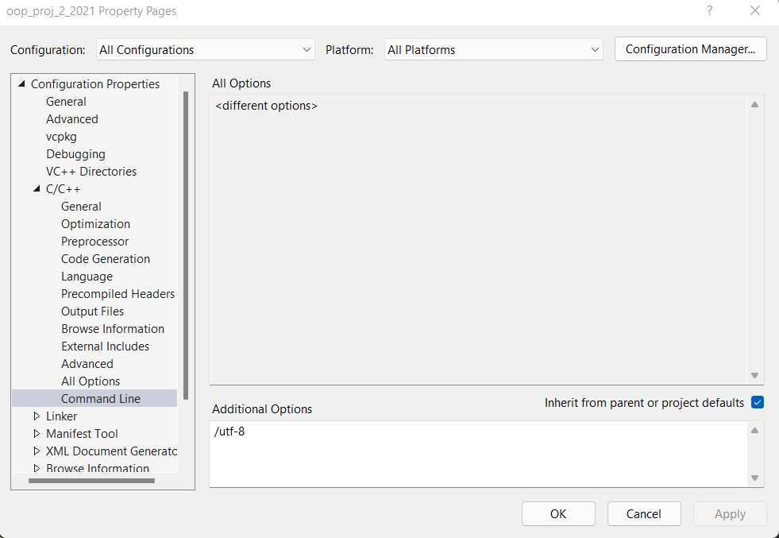

<style>
    img
    {
        width:100%;
        height:20%;
    }
</style>


##  Αλλαγή κωδικοποιησης στην γραμμή εντολών σε κωδιδικοποίηση utf8.

1. Αριστερό κλίκ στο project και επιλέξτε properties.
    

2. Από το μενού επιλέγουμε Configuration Manager->C/C++->properties


3. Στο πεδίο Additional Options προσθέστε το ακόλουθο:


```
    /utf-8
```

**:exclamation:Βήμα 2 και 3**

