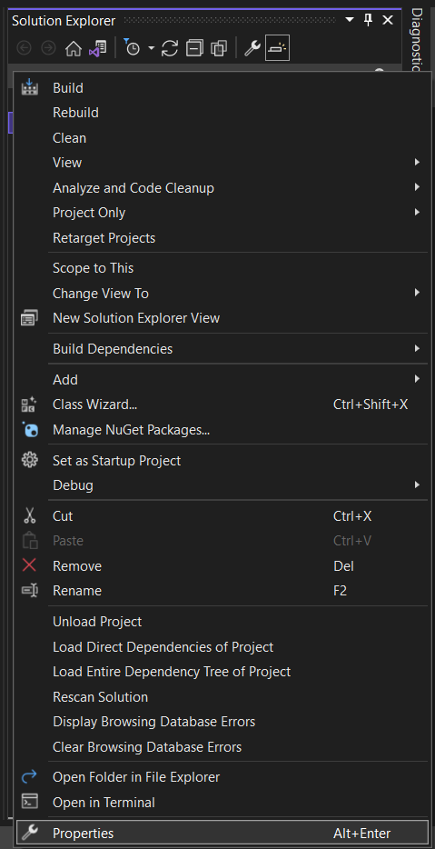

<style>
    img
    {
        width:100%;
        height:450px;
    }
</style>


##  Αλλαγή κωδικοποιησης στην γραμμή εντολών σε κωδικοποίηση utf8.

1. Αριστερό κλίκ στο project και επιλέξτε properties.
    

2. Από το μενού επιλέγουμε Configuration Manager->C/C++->properties


3. Στο πεδίο Additional Options προσθέστε το ακόλουθο:


```
    /utf-8
```

<u style="font-weight:bold; font-size:15px;">Βήμα 2 και 3</u>


