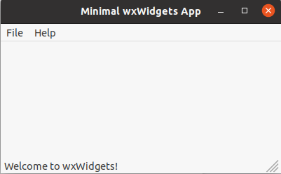
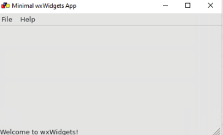

# Εγκατάσταση

* ## Linux

  * Λήψη πηγαίων αρχείων WxWidgets από [https://www.wxwidgets.org/downloads/](https://www.wxwidgets.org/downloads/)
    
    ```
        $ wget https://github.com/wxWidgets/wxWidgets/releases/download/v3.1.5/wxWidgets-3.1.5.tar.bz2
        $ tar -zxvf wxWidgets-3.1.5.tar.bz2
    ```
  * Προετοιμασία περιβάλλοντος
    
    **Θα χρειαστούμε τις βιβλιοθήκες ανάπτυξης που βασίζεται το framework των WxWidgets καθώς και ένα μεταγλωττιστή για C++ στα Linux g++. Επίσης προσθέτουμε και το πακέτο gtk που χρησιμοποιήται για την δημιουργία γραφικού περιβάλλοντος**
       
    ```
        $ sudo apt-get install libgtk-3-dev
        $ sudo apt-get install build-esssential
    ```
  * Μεταγλώττιση wxWidgets
    ```
      $ cd wxWidgets-3.1.5
      $ mkdir gtk-build
      $ cd gtk-build
      $  ../configure --disable-shared --enable-unicode
      $ make
    ```
  * Εγκατάσταση  wxWidgets
    ```
        $ sudo su
        $ make install
        $ ldconfig
        $ exit
    ```

  * Στον φάκελο gtk-build έχει δημιουργηθεί ένας υποφάκελος sample. Στον υποφάκελο sample μεταγλωττίζουμε τα παραδείγματα.
    ```
      $ cd samples
      $ make
      $ cd ../demos
      $ make
    ```
  * Εκτέλουμε το έτοιμο παράδειγμα minimal
    ```
      $ cd minimal
      $ ./minimal
    ```
    **Παράδειγμα wxWidgets**
    ---
    
  
  * ## Windows
  
    *  Εγκατάσταση wxWidgets:[https://github.com/wxWidgets/wxWidgets/releases/download/v3.1.5/wxMSW-3.1.5-Setup.exe](https://github.com/wxWidgets/wxWidgets/releases/download/v3.1.5/wxMSW-3.1.5-Setup.exe)
    *  Μεταγλώττιση wxWidgets(Τρέχον φάκελος C:\wxWidgets-3.1.5)
       ```
          $ cd build
          $ cd msw
          $ mingw32-make -f makefile.gcc SHELL=CMD.EXE SHARED=1 UNICODE=1 BUILD=release clean
          $ mingw32-make -f makefile.gcc SHELL=CMD.EXE SHARED=1 UNICODE=1 BUILD=release
       ```
    * Μεταγλώττιση παραδειγμάτων στον φάκελο samples και demos
       ```
          > cd samples
          > mingw32-make -f makefile.gcc SHELL=CMD.EXE SHARED=1 UNICODE=1 BUILD=release
          > cd ../demos
          >mingw32-make -f makefile.gcc SHELL=CMD.EXE SHARED=1 UNICODE=1 BUILD=release
       ```
    * Εκτέλεση παραδείγματος minimal
      ```
        > cd demos/minimal
        > minimal.exe
      ```
      
    * Ορισμός wxWidgets ως μεταβλητή περιβάλλοντος
      ```
        >set WINWX="PATH_TO_WX";%WINWX%
      ```

# Μεταγλώττιση εφαρμογής Hello World

* ## Linux

    Μεταγλώττιση hello_world.cpp
    ```
      $ g++ hello_world.cpp  `wx-config --cxxflags --libs` -o hello_world
    ```

    Εκτέλεση κώδικα
    ```
      $ ./hello_world
    ```

* ## Windows

  Αντιγραφή των ακολούθων dll() στον φάκελο της εφαρμογής
  ```
    - wxbase314u_gcc_custom.dll
    - wxmsw314u_core_gcc_custom.dll
  ```

  Μεταγλώττιση κώδικα
  ```
  >g++ hello_world.cpp -I%WXWIN%\\include -I%WXWIN%\\lib\\gcc_dll\\mswu -L%WXWIN%\\lib\\gcc_dll -lwxmsw31u_core -lwxbase31u -o hello_world
  ```  

  Εκτέλεση
  ```
    hello_world.exe
  ```

# Επιπλέον υλικό

* Linux-MacOS:[https://www.cs.sjsu.edu/~mak/tutorials/InstallwxWidgets.pdf](https://www.cs.sjsu.edu/~mak/tutorials/InstallwxWidgets.pdf)
* Windows:[https://www.youtube.com/watch?v=tHMGA0jIl3Y](https://www.youtube.com/watch?v=tHMGA0jIl3Y)